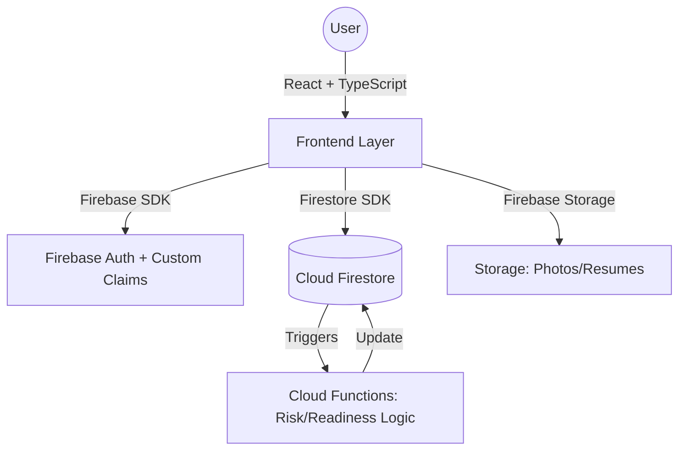

# Smart Digital College Ecosystem – QIS College of Engineering & Technology

[](https://opensource.org/licenses/MIT)
[](https://reactjs.org/)
[](https://firebase.google.com/)

## 1. Project Overview
The **Smart Digital College Ecosystem** is a production-grade digital transformation platform designed for QISCET. It replaces traditional, fragmented academic management with a centralized, data-driven system. Built to bridge the gap between academic performance and career readiness, it digitizes the entire student lifecycle—from admission to placement.

### Purpose
To provide institutional leaders, faculty, and students with real-time insights into academic health and professional growth.

### Problems Solved
- **Reactive Intervention**: Traditional systems identify at-risk students only after failure. Our system predicts risk early.
- **Skill Mismatch**: Students often don't know why they are rejected by specific companies. Our Skill Gap Analyzer provides the "Why" and the "How to fix."
- **Manual Workflows**: Digitizes ID card generation, resume building, and transport tracking.

---

## 2. Key Features

### 🔐 Authentication & Role-Based Access Control (RBAC)
Secure access managed via Firebase Authentication and Custom Claims.
- **Admin**: Full system control (Student/Faculty management, Analytics).
- **Faculty**: Class-specific monitoring, risk alerts, and student performance tracking.
- **Student**: Personalized dashboard, Resume builder, Placement readiness scoring.

### 📈 Predictive Performance Risk System
An early-warning algorithm that identifies students needing academic support.
- **Inputs**: Attendance, CGPA Trend, Internal Marks.
- **Logic**: `Risk Score = (0.4 × Attendance) + (0.3 × CGPA%) + (0.3 × Internal Marks%)`
- **Output**: Real-time alerts on Faculty dashboards with color-coded risk levels.

### 💼 Smart Placement Readiness Score
Evaluates a student's professional profile against industry standards.
- **Inputs**: Resume Score, CGPA%, Skill Count, Internship Count.
- **Output**: A percentage score indicating "Readiness Level" with actionable improvement suggestions.

### 🔍 Skill Gap Analyzer
Directly compares student profiles against company-specific requirements (e.g., Google, Microsoft, Amazon).
- **Process**: Select Company → Fetch Requirements → Compare Skills → Output Match % and Missing Skills.

### 🛠️ Advanced Tools
- **Resume Builder**: Multi-template system with real-time scoring and PDF export.
- **Digital ID Card**: QR-code backed institutional identity system.
- **Internship Portal**: Integrated application tracking and listing management.
- **Transport Tracker**: Smart route management with real-time timing updates.

### 🏛️ Academics & SDC (CSDS Exclusive)
Dedicated module for the **Computer Science & Data Science** branch, featuring specialized faculty and industry-aligned courses.

---

## 3. System Architecture


---

## 4. Database Structure (Firestore)

### `users`
- `uid`, `email`, `role`, `branch`, `academicYear`

### `students`
- `attendance`, `cgpa`, `internalMarks`, `skills[]`, `riskScore`, `placementReadinessScore`

### `companySkills`
- `companyName`, `requiredSkills[]`

---

## 5. Algorithms (Pseudo-code)

### Placement Readiness
```javascript
function calculateReadiness(resume, cgpa, skills, internships) {
    let skillScore = (skills.length / 8) * 100;
    let internshipScore = Math.min((internships.length / 3) * 100, 100);
    return (0.35 * resume) + (0.25 * cgpa * 10) + (0.25 * skillScore) + (0.15 * internshipScore);
}
```

---

## 6. Installation & Setup

1. **Clone the Repo**
   ```sh
   git clone https://github.com/SriRamkunamsetty/QIS-Smart-Connect.git
   ```
2. **Install Dependencies**
   ```sh
   npm install
   ```
3. **Environment Config**
   Create a `.env` file with your Firebase configuration.
4. **Run Development Server**
   ```sh
   npm run dev
   ```

---

## 7. Future Enhancements
- **AI Career Mentor**: GPT-based personalized learning paths.
- **Blockchain Credentials**: Immutable digital certificates.
- **Mobile App**: Native iOS/Android experience for real-time notifications.

---

## 8. Conclusion
The **Smart Digital College Ecosystem** is more than a management system; it is an intelligent companion for modern institutions. By leveraging predictive analytics and real-time data flow, QISCET ensures its students are not just graduates, but industry-ready professionals.
